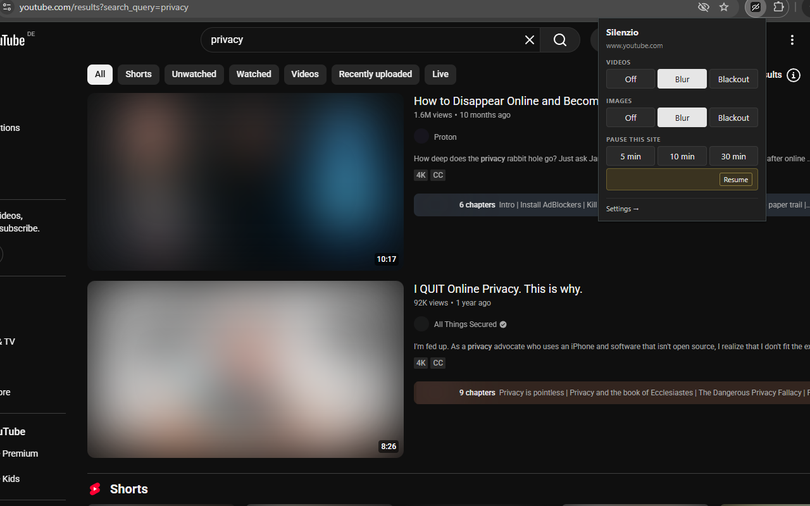
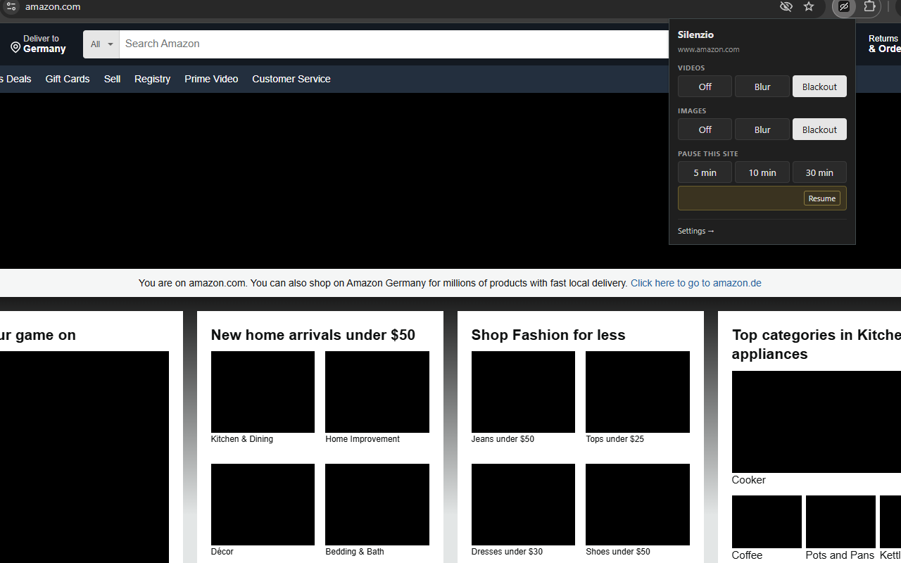

# Silenzio

A cross-browser extension that blurs or blacks out videos and images and mutes audio across the web — useful when you want to scroll feeds without being pulled in by autoplay, motion, or unexpected visual content.

Works on standard `<video>` players, short-form feeds (YouTube Shorts, LinkedIn feed, etc.), and all `` content (JPG, PNG, GIF, WebP, SVG-as-img).

**[Install from the Chrome Web Store →](https://chromewebstore.google.com/detail/pnlbpemienlnbiofmdjldbbnpfkfpndd)**

## Screenshots





## Features

- **Per-type modes** — independent Off / Blur / Blackout for videos and images.
- **Audio muting** — `<video>` and `<audio>` are muted whenever video filtering is active. Capture-phase listeners catch sites trying to unmute or swap sources.
- **Scope** — apply everywhere, only on a list of sites, or everywhere *except* a list of sites. Hostname suffix match (one entry covers subdomains).
- **Pause timers** — pause on the current site for 5/10/30 minutes from the popup, or pause globally for 15/60 minutes from settings. Auto-resumes.
- **Working hours** — optional schedule so Silenzio is only active during a daily time window on selected days (default Mon–Fri 09:00–17:00).
- **Dark mode** — popup and settings follow your browser/OS theme.

## Install

### Chrome / Edge

Install from the [Chrome Web Store](https://chromewebstore.google.com/detail/pnlbpemienlnbiofmdjldbbnpfkfpndd).

To load from source (for development, or to try changes before a release reaches the store):

1. Open `chrome://extensions` (or `edge://extensions`).
2. Enable **Developer mode**.
3. Click **Load unpacked** → select this repo's root directory.

### Firefox

Not yet published on AMO. Load temporarily:

1. Open `about:debugging#/runtime/this-firefox`.
2. Click **Load Temporary Add-on…** → pick [manifest.json](manifest.json).
3. Click the Silenzio toolbar icon → puzzle-piece menu → Silenzio → **Always allow on all websites**. (One-time; Firefox MV3 requires explicit host-permission grant.)

## Usage

Click the toolbar icon to open the popup:

- Mode rows for **Videos** and **Images** — Off / Blur / Blackout.
- **Pause this site** — 5 / 10 / 30 minute buttons.
- **Settings →** opens the full options page (scope rules, working hours, global pause).

## What's not handled (yet)

- CSS `background-image` decorations (avatars, hero banners painted via `background-image`).
- Inline `<svg>` (icons mostly — `` *is* handled).
- `<canvas>` elements.
- Web Audio API graphs that bypass `HTMLMediaElement.muted`.

## Privacy

Silenzio collects no data, transmits nothing, and uses no third-party scripts. See [PRIVACY.md](PRIVACY.md) for the full policy and permission justifications.

## Development

Manifest V3 cross-browser package — no build step. The content script runs on every frame at `document_start`, applies CSS filter classes to `<video>`, `<audio>`, and `` elements, and re-applies on DOM mutations via `MutationObserver`. State — modes, scope rules, pause expiries, working-hours schedule — is stored as a single object in `chrome.storage.local`. The popup and options page subscribe to `storage.onChanged` so changes propagate live to every open tab.

To regenerate the toolbar icons after editing [scripts/make-icons.py](scripts/make-icons.py):

```sh
python3 scripts/make-icons.py
```

Requires Pillow (`pip install pillow`).

## License

[MIT](LICENSE).
